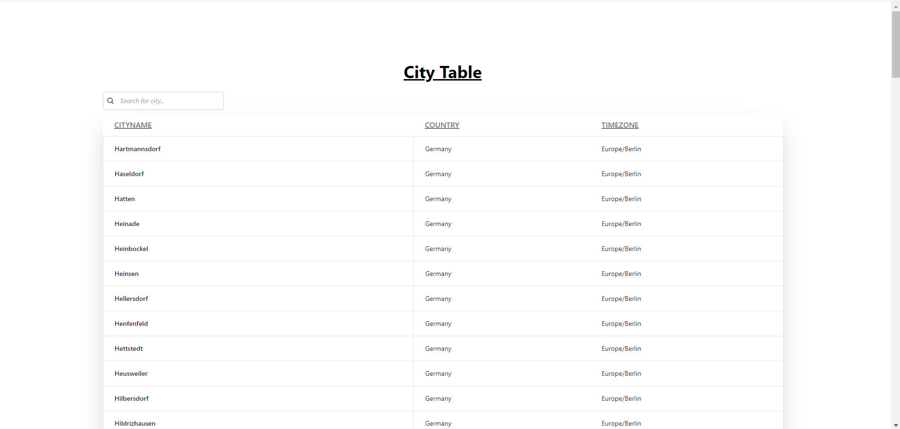
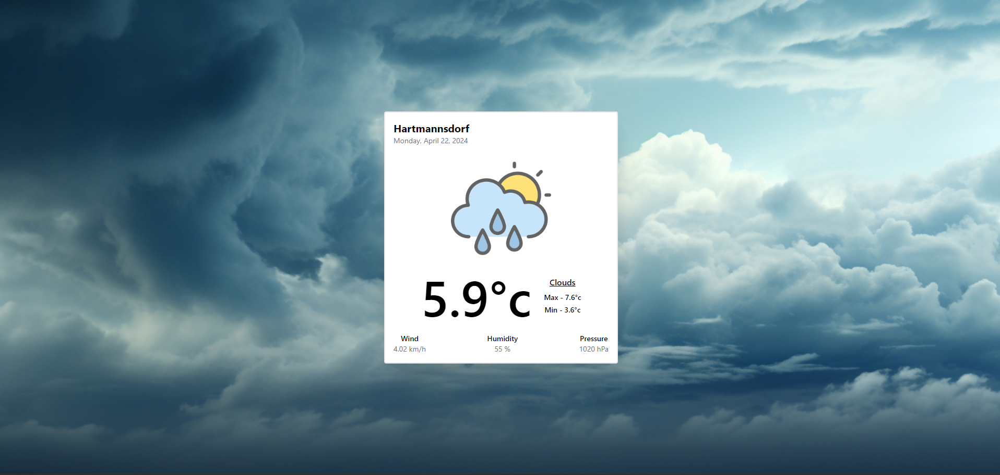

# Weather Forecast
## Live link:- [https://react-weather-sandy.vercel.app]()

### Technology :- React, TypeScript and TailwindCss
#### API For city data - https://public.opendatasoft.com/explore/dataset/geonames-all-cities-with-a-population-1000/api/?disjunctive.cou_name_en&sort=name).
#### API For weather - https://openweathermap.org

## *How to install and run locally ?*

$ git clone https://github.com/Garrur/react-weather

$ npm install

$ npm run start

*Screenshot of City Table*

*Screenshot of Weather Page*

## Installation

1. Fork this repository to your github account.
2. Clone the forked repository and proceed with steps mentioned below.

## Getting Started with React App

This project was bootstrapped with [Create React App](https://github.com/facebook/create-react-app). 

## Available Scripts

In the project directory, you can run:

### `npm start`

Runs the app in the development mode.\
Open [http://localhost:3000](http://localhost:3000) to view it in the browser.

The page will reload if you make edits.\
You will also see any lint errors in the console.

### `npm test`

Launches the test runner in the interactive watch mode.\
See the section about [running tests](https://facebook.github.io/create-react-app/docs/running-tests) for more information.

### `npm run build`

Builds the app for production to the `build` folder.\
It correctly bundles React in production mode and optimizes the build for the best performance.
